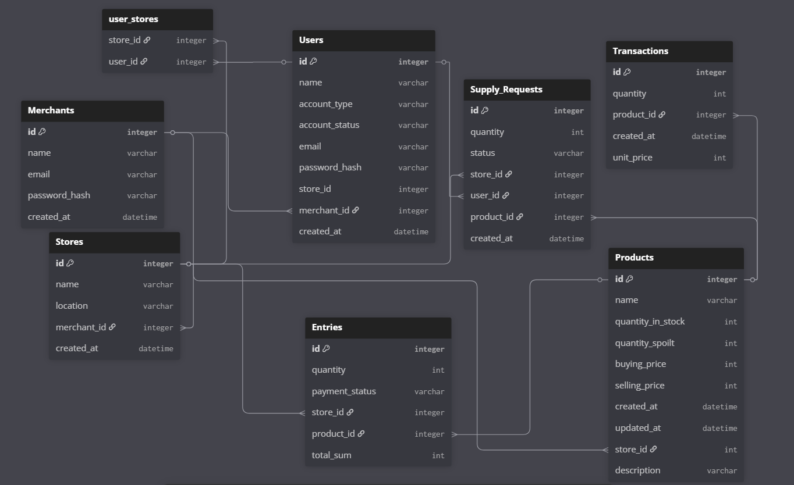

# MyDuka

**Smart Inventory Management for Kenyan Businesses**

MyDuka is a simple, intuitive stock management system that helps clerks and business owners manage inventory, track sales and requests, and generate reports for better decision-making.

## 🌟 Features

- 🛒 Product Management – Add, update, and view stock levels easily

- 📦 Entries & Transactions – Log purchases, sales, and spoilt goods

- 🔍 Search & Filter – Quickly find products or records

- 📊 Reports – Auto-generated sales, stock, and spoilage summaries

- 🔐 Authentication – Role-based access for clerks, admins, and suppliers


## 🛠 Tech Stack

**Backend**

- Python & Flask
- SQLAlchemy (ORM)
- Flask-JWT-Extended for authentication
- Flask-Mail for email notifications
- SQLite (for dev), easily switchable to PostgreSQL

**Frontend**

- React (Vite + TailwindCSS)
- React Router for navigation
- Axios for API calls
- Jest & React Testing Library for testing

## 📦 Schema overview

[ERD](https://dbdiagram.io/d/MyDuka-6876433df413ba3508f5abe2)



## 🚀 Getting Started

Follow the steps below to set up and run MyDuka locally:

1. Fork and clone the repository
```
git clone git@github.com:Ian-wafula1/MyDuka.git
```
2. Navigate into the project directory
```
cd MyDuka
```
3. Install dependencies
```
npm install --prefix client
pipenv install
pipenv shell
```
4. Run the build script
```
npm run build --prefix client
```
5. Start the server
```
cd server
python app.py
```

# 🙌 Contributing

Pull requests are welcome. For major changes, open an issue first to discuss what you would like to change.

# 📝 License

MIT License

# 👨‍💻 Authors
<!-- Ian Wafula, Victor Mochoge, Joyce Benson, Wilfred Kiprop, Faith Chepkok -->
- [Ian Wafula](https://github.com/Ian-wafula1)
- [Victor Mochoge](https://github.com/Zhero-Six)
- [Joyce Benson](https://github.com/JOYCE-BENSON)
- [Wilfred Kiprop](https://github.com/wilfred-sudo)
- [Faith Chepkok](https://github.com/Faith-Chepkok)
